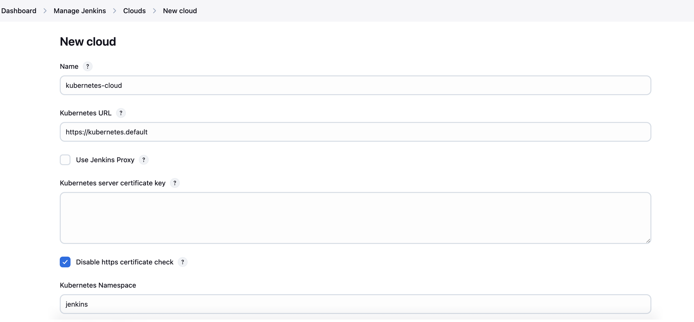

## README in progress 
- namespace
- PVC yaml (explain why the access mode is ReadWriteOnce)
- SA yaml
- Jenkins deployment yaml (explain why there are 2 ports) and also add the SA in the spec, so that jenkins can connect to it
- Role 
- Role binding

Port	Purpose	Do You Need It?
8080	Jenkins Web UI	✅ Always required
50000	JNLP agent communication	❌ Only needed if using JNLP agents

- service (using nodeport here for a better understanding of it). It's less secured as compared to ingress.

minikube service jenkins-service -n jenkins --url
use the output (http://127.0.0.1:53135)

jenkins configuration ()

Trying to test the configuration (create the certificate (SA))

